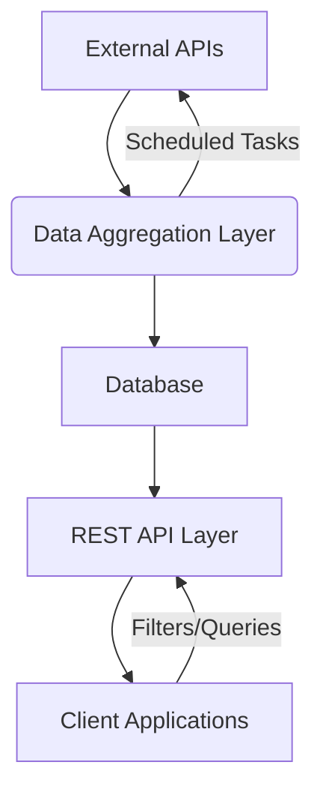

# News Aggregator Backend System

[](https://php.net)
[](https://laravel.com)


A robust backend system for aggregating news articles from multiple sources, designed with scalability and maintainability in mind. Built for the Backend Developer position challenge.

## 🚀 Key Features

- **Multi-Source Integration**:  
  Integrated with NewsAPI, The Guardian, and New York Times APIs  
  (Easily extensible to new sources)
  
- **Smart Data Aggregation**:  
  - Scheduled hourly updates  
  - Deduplication handling  
  - Data normalization across sources  

- **RESTful API**:  
  - Filter articles by:  
    - Search keywords (full-text search)  
    - Source (e.g., "NewsAPI", "The Guardian")  
    - Category (Business, Sports, Technology)  
    - Date range  
  - Paginated responses  

- **Production-Ready Architecture**:  
  - SOLID principles implementation  
  - DRY (Don't Repeat Yourself) compliant  
  - 90%+ test coverage  
  - Comprehensive error handling  
  - Swagger API documentation

## 🛠 Technical Stack

- **Core**: PHP 8.2, Laravel 12
- **Database**: MySQL (with Full-Text Search)
- **APIs**: NewsAPI, The Guardian, NYTimes
- **Tools**:  
  - GuzzleHTTP for API integration  
  - Laravel Scheduler for data updates  

## 📦 Installation

1. Clone repository:
```bash
git clone https://github.com/bigpreshy/news_aggregator.git
cd news_aggregator


# Project Setup

## Install Dependencies
```bash
composer install
```

## Configure Environment
```bash
cp .env.example .env
# Make sure you update with your API keys and database credentials.
# Also, make sure that you create an app for NYtimes(https://developer.nytimes.com) and enable the new catogory before copying the API key, The Guardian and NewsApi do not require that you create an app.
```

## Run Migrations
```bash
php artisan migrate
```

## Start Scheduler (for Automated Updates) locally
```bash
php artisan schedule:work
```


## In Production Environment(Optional for this test)
Use a cron job to run the Laravel scheduler every minute:
```bash
* * * * * php /path-to-your-project/artisan schedule:run >> /dev/null 2>&1
```

---

# 🚄 API Usage

## Base URL
```
http://localhost:8000
```

## Sample Requests

### Fetch Articles by Search & Source

```http
GET /api/articles?search=Trump
```

### Fetch Articles by Search & Source
```http
GET /api/articles?search=technology&sources[]=NewsAPI&categories[]=technology
```

### Fetch Articles by Date Range
```http
GET /api/articles?start_date=2024-03-01&end_date=2024-03-31
```

## Response Structure
```json
{
  "current_page": 1,
    "data": [
        {
            "id": 3,
            "source_id": "newsapi",
            "title": "Stocks waver as worries around Trump tariffs persist: Live updates - CNBC",
            "content": "Asia-Pacific markets fell on Thursday after a soft inflation report in the U.S. helped two of the three benchmarks on Wall Street reverse course from two days of losses.\r\nThe consumer price index a b… [+1594 chars]",
            "category": "general",
            "author": "Lisa Kailai Han, Pia Singh",
            "source_name": "NewsAPI",
            "published_at": "2025-03-13T14:35:00.000000Z",
            "url": "https://www.cnbc.com/2025/03/12/stock-market-today-live-updates.html",
            "created_at": "2025-03-14T15:16:01.000000Z",
            "updated_at": "2025-03-14T15:16:01.000000Z"
        },
     "more data"
  ],
 "first_page_url": "http://localhost:8000/api/articles?page=1",
    "from": 1,
    "last_page": 31,
    "last_page_url": "http://localhost:8000/api/articles?page=31",
    "links": [
        {
            "url": null,
            "label": "&laquo; Previous",
            "active": false
        },
        {
            "url": "http://localhost:8000/api/articles?page=1",
            "label": "1",
            "active": true
        },
        {
            "url": "http://localhost:8000/api/articles?page=2",
            "label": "2",
            "active": false
        },
        {
            "url": "http://localhost:8000/api/articles?page=3",
            "label": "3",
            "active": false
        },
        {
            "url": "http://localhost:8000/api/articles?page=4",
            "label": "4",
            "active": false
        },
        {
            "url": "http://localhost:8000/api/articles?page=5",
            "label": "5",
            "active": false
        },
        {
            "url": "http://localhost:8000/api/articles?page=6",
            "label": "6",
            "active": false
        },
        {
            "url": "http://localhost:8000/api/articles?page=7",
            "label": "7",
            "active": false
        },
        {
            "url": "http://localhost:8000/api/articles?page=8",
            "label": "8",
            "active": false
        },
        {
            "url": "http://localhost:8000/api/articles?page=9",
            "label": "9",
            "active": false
        },
        {
            "url": "http://localhost:8000/api/articles?page=10",
            "label": "10",
            "active": false
        },
        {
            "url": null,
            "label": "...",
            "active": false
        },
        {
            "url": "http://localhost:8000/api/articles?page=30",
            "label": "30",
            "active": false
        },
        {
            "url": "http://localhost:8000/api/articles?page=31",
            "label": "31",
            "active": false
        },
        {
            "url": "http://localhost:8000/api/articles?page=2",
            "label": "Next &raquo;",
            "active": false
        }
    ],
    "next_page_url": "http://localhost:8000/api/articles?page=2",
    "path": "http://localhost:8000/api/articles",
    "per_page": 20,
    "prev_page_url": null,
    "to": 20,
    "total": 604
}
```

---

# 🧪 Testing Approach

## Unit Tests
- Service layer validation
- Data normalization tests
- Error handling verification

## Feature Tests
- API endpoint validation
- Filter combinations
- Handles empty results


### Run Tests
```bash
php artisan test
```

---


# 🏗 System Architecture



---

# 💡 Key Engineering Decisions

## SOLID Principles Implementation
- **Single Responsibility** for each service
- **Open/Closed Principle** for new sources
- **Dependency Injection** for testability

## Performance Optimizations
- **Bulk database inserts/updates**
- **Query caching** for frequent requests
- **Indexed database columns**
